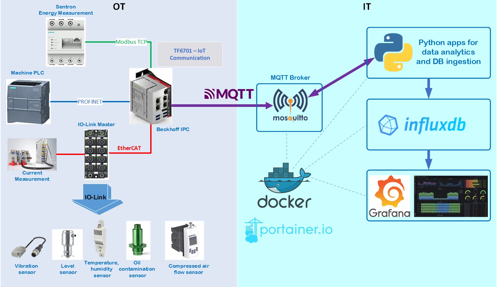

# IIoT Real-Time Analytics using Python, MQTT and Beckhoff IPC....


IIoT project for data exchange between PLC in OT and IT area with usage of MQTT protocol.  

#### System Diagram


#### General Overview
Using this framework it's possible to collect data from different sensors, PLCs and devices in OT area. The collected data are preprocessed in Beckhoff IPC, converted into JSON payload and published with MQTT into IT area.

In IT area, there are couple of containerized  applications which run using Docker (Docker-Compose) and Portainer.
Python apps (as opc ua clients) request data from Bechkoff IPC (as opc ua server) and perform analytics, anomaly detection in sensor signals and finally save the results in time series database InfluxDB. 
The graphical results are visible as dashboards in Grafana.


#### Detailed description:
Folder `apps` includes:
* `global`
* `industrial_line1`

`global` is the main component which runs Eclipse Mosquitto Mqtt Broker, InfluxdB, Grafana, Portainer - all of them as Docker containers. This stack should always be in operation.

`industrial_line1`  - multiple Python apps as Docker containers. Some Python applications are quite simple and just poll OPC UA data and ingest them directly in proper format into InfluxDB. Other are more complex and include anomaly detection (z-score method) on sensor signals.
The file `industrial_line.yml` for docker-compose can be composed of many single entries for each Python app. Respective `docker-compose` config for each Python app can be found in folder  `/src/subfolder_for_python_app` 

Folder `apps_data` are persistance configs and data from Grafana, InfluxDB, Mqtt Broker, Portainer and Prometheus. These are mounted as Docker bind mounts.

Folder `docs` includes photos ans pictures for documentation

Folder `mqtt-simulator-main` is simplified mqtt signal generator which can be used for test purposes.
However, for this project, the Beckhoff IPC with TwinCat is the main source of the mqtt data. There is separate repo with TwinCat code. 

Folder `src` consists of multiple Python apps which can be deployed as Docker containers. Following apps are available:
* `electrical_anomaly_analytics_zscore` - 
calculates analytics like definite integral of electrical current over fixed time, electrical current assymetry and inrush current. Z-Score anomaly detection algorithm is then applied to integral and inrush current 

* `multiple_signal_monitor` - 
catches data over MQTT from multiple sensors and stores its values into InfluxDB

* `multiple_state_monitor` - 
catches data over MQTT from multiple states in production line and stores its values into InfluxDB
* `single_signal_anomaly_detect_zscore` - catches data over MQTT from single sensor, apply z-score anomaly detection algorithm on its value and store the results and timestamp into InfluxDB.
* `single_signal_monitor` - catches data over MQTT from single sensor and store its value and timestamp into InfluxDB.
* `vibration_anomaly_detect_z_score` - reads acceleration data from vibration sensor over MQTT, calculates anomalies using z-score method and stores results in InfluxDB.
* `air_valve_anomaly_detect_zscore` - reads air valve travel times over from MQTT, calculates anomaly using z-score method and stores results to InfluxDB

### Setup & Run
The prerequisite is that Docker is installed on the target system.
```
cd /apps/global/build
bash compose_start.sh
```
After all containers from global are running properly, do next:

```
cd /apps/industrial_line1/build
bash compose_start.sh
```

The IPC Beckhoff should also be running and expose OPC UA data. For test purposes `mqtt-simulator-main` can be used (no Docker container)


