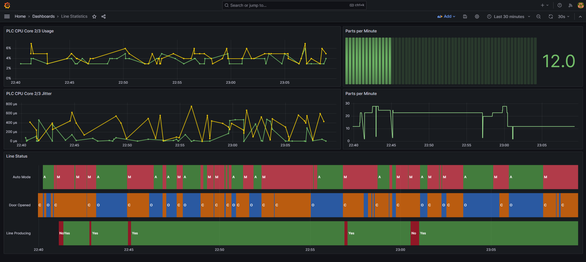

## Multiple state monitor

This script reads data over MQTT from mutliple states(state value is INT)

It subscribes to mqtt topic of this schema:
`<LINE_NAME>/<MACHINE_NAME>/#`

and on wildcard `#` level, `<STATE_NAME>` of respective state is expected. 

The script stores state's value and timestamp into InfluxDB.

It expects following JSON in Mqtt payload:
* "LineName": `(string)`
* "MachineName": `(string)`
* "StateName": `(string)`
* "StateValue": `(int)`
* "TimeStamp" `(int) - as Epoch Unix (13 digits)`

Examples of air sensor data are depicted on the below screens: 

