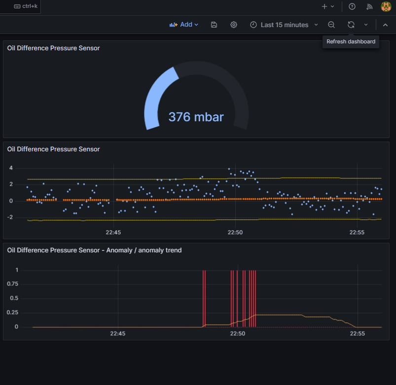

## Anomaly detection with z-score algorithm on single signal

This script reads data over MQTT from single sensor,
applies z-score anomaly detection algorithm
on its value and stores the results
and timestamp into InfluxDB.

It subscribes to mqtt topic of this schema:
`<LINE_NAME>/<MACHINE_NAME>/<SENSOR_NAME>`

It expects following JSON in Mqtt payload:
* "LineName": `(string)`
* "MachineName": `(string)`
* "SensorName": `(string)`
* "SensorValue": `(float)`
* "TimeStamp": `(ulint) - as Epoch Unix (13 digits)`

Example of anomaly detection for oil contamination sensor is depicted on the screens below.
Anomaly for single data point is marked as red bar. However these are only single marks for each data point. For better overview of anomalies amount within a time window there is also anomaly trend available.

