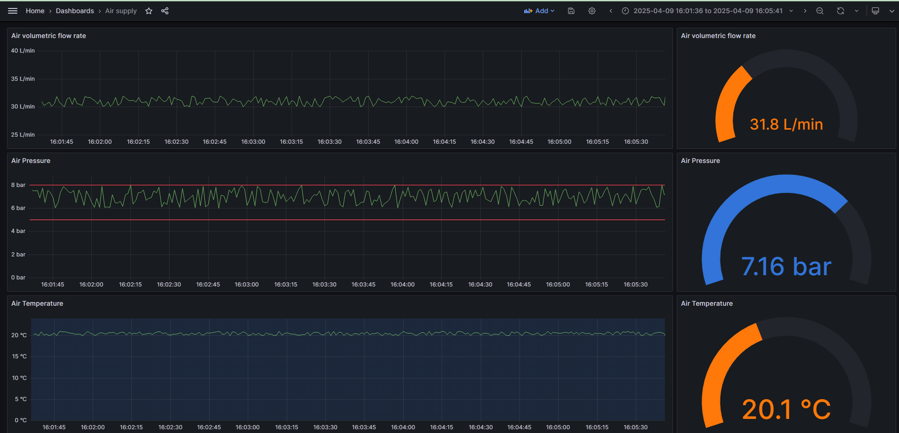

## Single signal monitor

This script reads data over MQTT  from single sensors(sensor value is FLOAT)
and store its value and timestamp into InfluxDB.

It subscribes to mqtt topic of this schema:
`<LINE_NAME>/<MACHINE_NAME>/<SENSOR_NAME>`

It expects following JSON in Mqtt payload:
* "LineName": `(string)`
* "MachineName": `(string)`
* "SensorName": `(string)`
* "SensorValue": `(float)`
* "TimeStamp": `(ulint) - as Epoch Unix (13 digits)`

Examples of air sensor data are depicted on the below screens:

