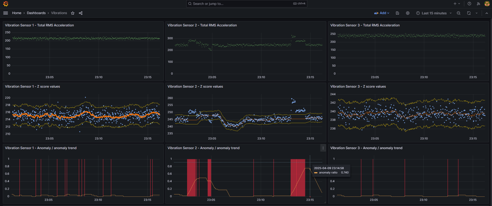

## Anomaly detection with z-score algorithm on vibration sensor

It read single vibration sensor data (acceleration) over MQTT.
Next, it calculates anomalies using z-score method and stores results  with timestamp in InfluxDB.

It subscribes to mqtt topic of this schema:
`<LINE_NAME>/<MACHINE_NAME>/<SENSOR_NAME>`

It expects following JSON in Mqtt payload:
* "LineName": `(string)`
* "MachineName": `(string)`
* "SensorName": `(string)`
* "VibAccelTotRmsX": `(float) - rms vibration acceleration in x axis `
* "VibAccelTotRmsY": `(float) - rms vibration acceleration in y axis `
* "VibAccelTotRmsZ": `(float) - rms vibration acceleration in z axis `
* "SensorTemperature": `(float)`
* "TimeStamp": `(ulint) - as Epoch Unix (13 digits)`

Final result are  visible in Grafana.
Any abnormal behaviour of vibration acceleration is indicated as anomaly (red bars). However these are only single marks for each data point. For better overview of anomalies amount within a time window there is also anomaly trend available.

